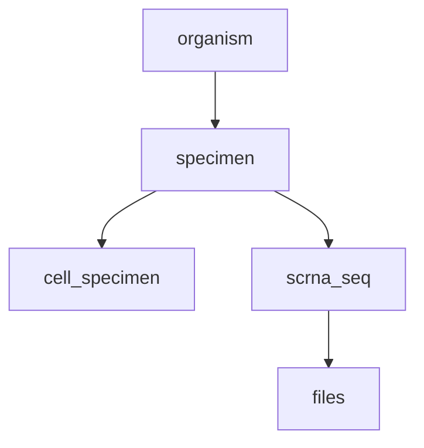

# ag2pi-2-ingest
Repository dedicated to the tool development necessary to ingest datasets from the AG2PI into ingest and, finally, into terra.

The folders contain the following:

## examples
Input - Contains the input given (In JSON format). In the case of the pilot project, it contains `analysis.json`, `samples.json` and `scRNA-seq.json`
For each of the entities present in the input, they have been split up, and given a name based on the sample names (+ type) or the file name.


Base process - Contains an example process metadata file that uses HCA metadata standards. Used to create processes.

Base sequence file - Contains an example sequence file metadata file that uses HCA metadata standards.

output - Clean data from the `src/clean_data.py` script

## src
All the scripts and code written is deposited here - There are 2 main folders:

### json_cleaner
A small class has been written to deal with JSON parsing and operations - Currently, it is able to:
- Add a new field with any value
- Delete null values
- Return the value of a field given a full qualified key
- Replace all values that match a value provided

### utilities
Small scripts, written to help deal with the submission tasks.

- clean_data.py: Given an input and an output path, read all the JSON files and perform clean-up. The clean-up performed depends on the file, but it can be resumed in:
   * Add missing fields (e.g. `describedBy`)
   * Delete null values
   * Replace values when there is a typo or the value is not allowed
- create_submission.py: Given a project UUID, create an empty submission and link it to that project.
- submit_entities.py: Given an input path with all the entities ready to submit (Post clean-up), and a submission URL (API link), submit the entities to the submission for validation.
- clear_entities.py: Given a submission link, delete all the biomaterials and files present in the submission.
- biomaterial_linker.py: links existing biomaterials in the submission, based on metadata available.
- submit_files_from_ENA_report: given an accession, create the metadata and submit it for sequence files.
- file_linker: Takes the metadata about the files and links them with the existing biomaterials in a submission

In the next section, there will be a brief "How to" on how to use these scripts for testing, as well as how to validate the entities against the custom schemas.

## How to create a submission

Before the submission:
- Create a virtual environment and set up requirements
```bash
virtualenv create ag2pi_env
source ag2pi_env/bin/activate
cd src/utilities
pip install -r requirements.txt 
```

- Clean the data provided with the script in utilities. This will create several biomaterials.

```bash
cd src/utilities
python3 clean_data.py <input_folder> <output_folder>
```

- Validate the generated output, using [BioValidator](https://github.com/elixir-europe/biovalidator)

You have an empty submission:

1. [Retrieve your token](https://ebi-ait.github.io/hca-ebi-dev-team/operations_tasks/api_token.html)
2. Retrieve the project UUID. This can be extracted from the UI. Save it, it will be used in the next steps
3. Set your token
```bash
export INGEST_TOKEN="Bearer $token"
```
3. Run scripts in order:
```bash
cd src/utilities
python create_submission.py $project_uuid
```
This will print a submission URL. Click in there, and annotate the submission UUID (`'uuid': {'uuid': 'submission_uuid'}}`).
This will be our `$submission_uuid`

```bash
python submit_entities.py $output_folder $submission_uuid
```

**Please note**, variables in between steps are re-used, so the `$output_folder` variable used here is the same as the `$output_folder` variable used in the `clean the data` step.

This step may take some time, so please be patient. If any 400 error arises, please ensure you have set-up your token correctly or you are pointing to the correct submission UUID.

```bash
cd src/utilities
python biomaterial_linker.py $submission_uuid $examples_path
```
This will link the biomaterials together, based on the metadata available in the entities. The `$examples_path` is the 
full path to the `examples` folder in the repository.

```bash
cd src/utilities
python submit_files_from_ENA_report.py $submission_uuid $ena_project_accession $examples_path
```

In this case, the ENA project accession was `PRJEB43826`. This script retrieves the information about the sequence files and translates it to metadata in the system, creating associated processes.

```bash
cd src/utilities
python file_linker.py $submission_uuid
```

The submission is now ready. Next steps are:

- Put it to graph valid.
- Export

Current issues: Spreadsheet generation blocking export. Talking with devs how to


## Questions

- Sequence files were not included in the metadata, but I found them in ENA. I have adapted that
- There are several BioSamples accessions in ENA (22), but only 7 in the metadata provided.
- I have adapted the experimental designs to look like this:

Regarding provenance, could you confirm it is correct?

- Matrices: the files provided just refer to general files. I can curate the metadata for those files, it should be easy, but I want to confirm:
  What kind of data are you trying to push to terra? everything?